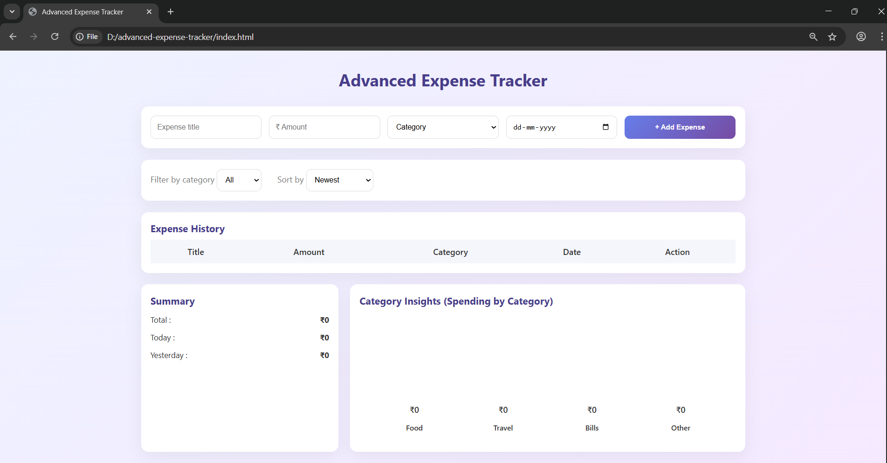
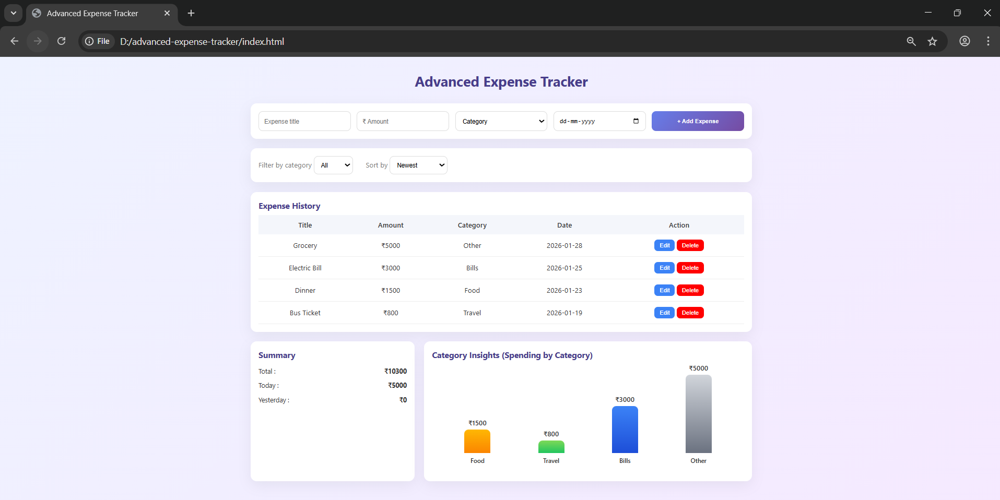
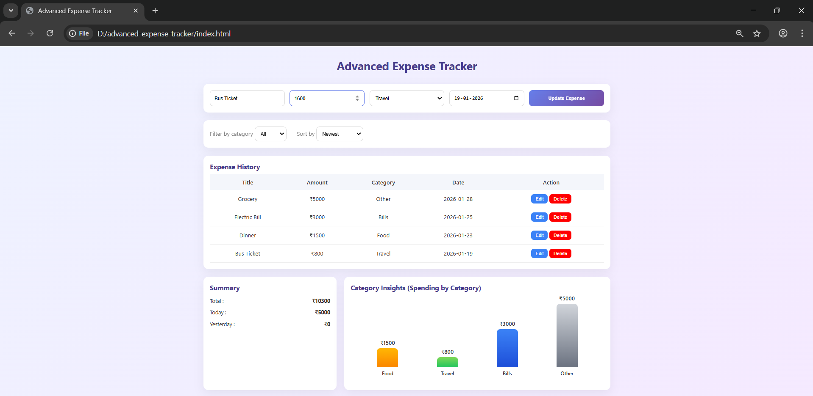
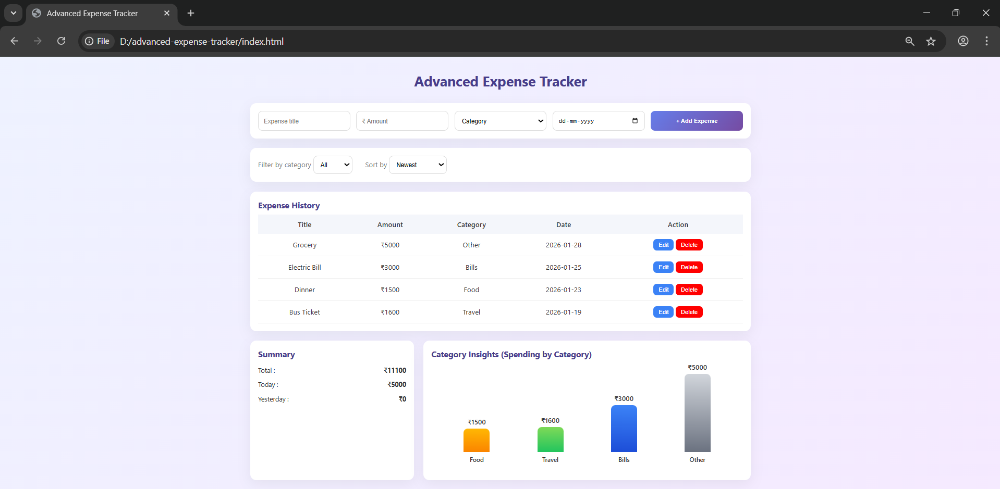
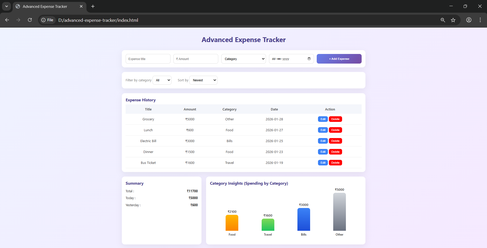
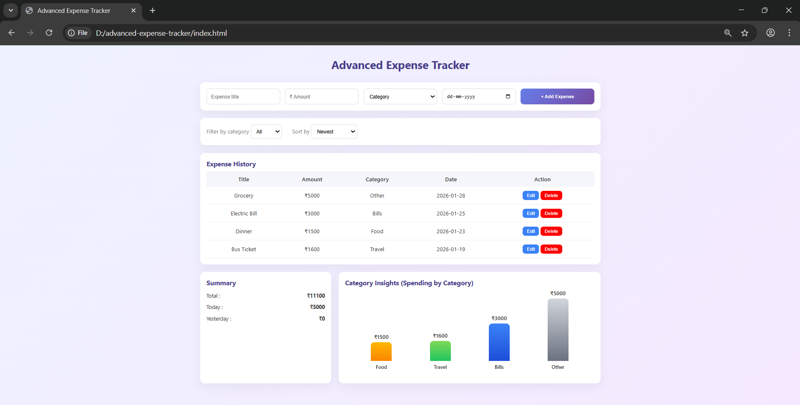

# Advanced Expense Tracker with Category Insights

A client-side **Advanced Expense Tracker** built using **HTML, CSS, and Vanilla JavaScript**.  
This application allows users to track daily expenses, analyze category-wise spending, and visualize data using a simple bar chart — all without any external libraries.

---

## 🚀 Project Overview

The **Advanced Expense Tracker with Category Insights** helps users:
- Add expenses with title, amount, category, and date
- View expenses in a sortable and filterable list
- Track total spending and daily comparisons
- Analyze category-wise expense distribution
- Persist data using browser `localStorage`

---

## ✨ Features

- ➕ Add new expenses (Title, Amount, Category, Date)
- ✏️ Edit existing expenses
- ❌ Delete expenses with confirmation
- 🔍 Filter expenses by category
- 🔃 Sort expenses by:
  - Newest date
  - Oldest date
  - Highest amount
  - Lowest amount
- 📊 Category-wise bar chart (pure CSS & JS)
- 📅 Today vs Yesterday expense comparison
- 💾 Persistent data using `localStorage`

---

## 🛠️ Technologies Used

- **HTML5** – Structure
- **CSS3** – Styling & responsive layout
- **JavaScript (Vanilla)** – Logic & DOM manipulation

---

## 📸 Screenshots

### Main Dashboard

### Add Expense

### Edit Expense

### Delete Expense

